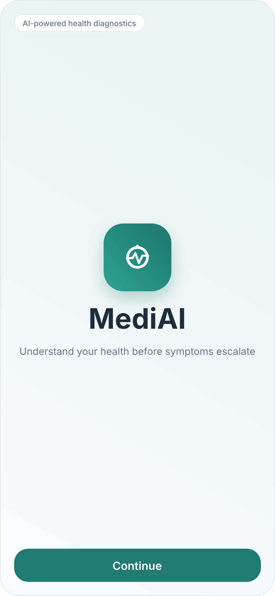
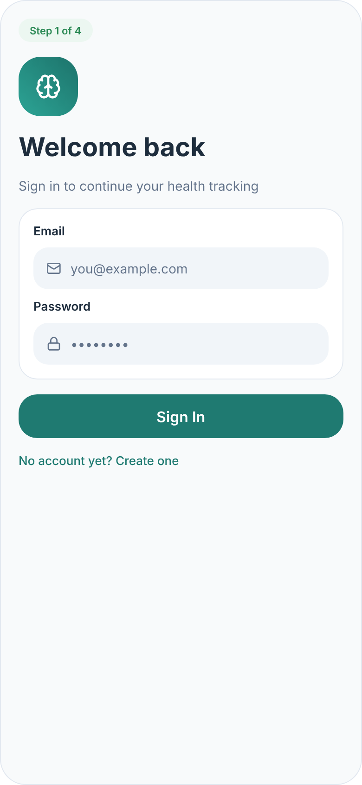
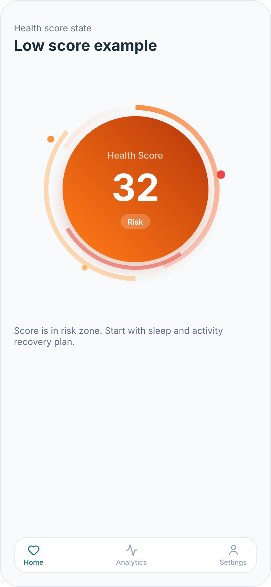
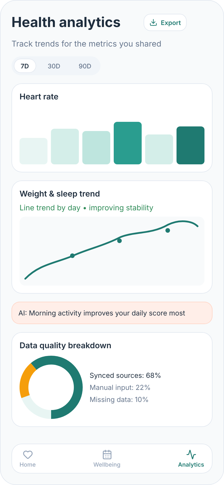
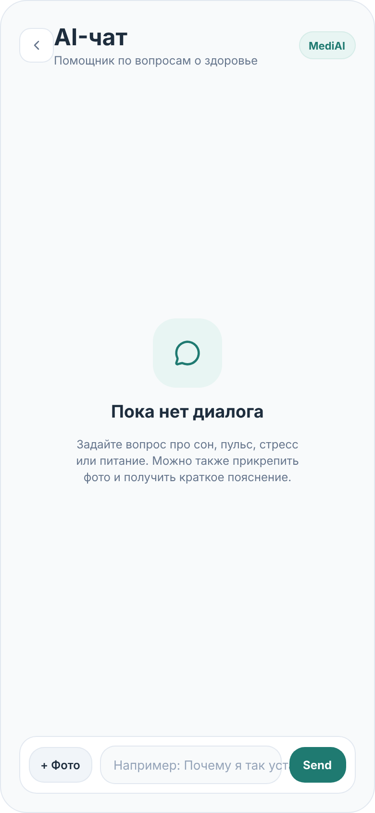
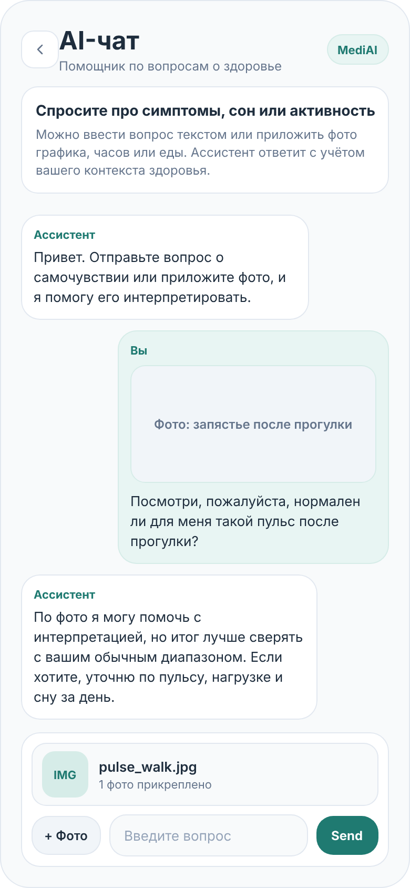

# MediAI

Flutter-приложение для персонального мониторинга самочувствия.

## Интерфейс приложения

Макеты экранов ниже экспортированы из [`assets/data/design.pen`](./assets/data/design.pen).

<p align="center">
  
  
  
</p>

<p align="center">
  
  
  
</p>

## До / После

Для демонстрации AI-чата можно показать состояние до взаимодействия и после получения ответа.

<table>
  <tr>
    <td align="center"><b>До</b></td>
    <td align="center"><b>После</b></td>
  </tr>
  <tr>
    <td align="center">
      
    </td>
    <td align="center">
      
    </td>
  </tr>
</table>

## Видео-демо

[](https://drive.google.com/file/d/1ofhHkBttY9t0AhrqCAMDQsqtIojaPOSO/view?usp=sharing)

Прямая ссылка: https://drive.google.com/file/d/1ofhHkBttY9t0AhrqCAMDQsqtIojaPOSO/view?usp=sharing

## Что есть в проекте

- Firebase Auth + Firestore для удалённой авторизации и синхронизации.
- Локальный fallback-режим, если Firebase отключён флагом или не инициализировался.
- AI-чат на Groq с поддержкой text/vision моделей.
- Опциональный AI proxy в [`workers/groq-proxy`](./workers/groq-proxy).
- Локальные ONNXмодели для аналитики.
- Performance tracing в приложении и автоматизация профилирования на Android.

## Feature map (`lib/features`)

- `ai_assistant`
- `analytics`
- `auth`
- `dashboard`
- `data_input`
- `diagnostics`
- `export`
- `health_data`
- `onboarding`
- `permissions`
- `profile`
- `reports`
- `settings`
- `splash`
- `wellbeing`

## Технический стек

- Flutter, Dart `^3.8.1`
- `flutter_bloc`, `get_it`, `go_router`
- `firebase_core`, `firebase_auth`, `cloud_firestore`
- `firebase_performance` 
- `health`, `permission_handler`, `image_picker`
- `onnxruntime` для работы локальных моделей


## Требования

- Flutter SDK c Dart `3.8.1` или совместимой версией из ветки `3.8.x`
- Android Studio / Xcode для целевой платформы
- Python `3.9+`, если нужно пересобирать ML-артефакты
- shell-доступ из корня репозитория

## Быстрый запуск

Все команды выполняются из корня репозитория.

### 1) Установить зависимости

```bash
flutter pub get
```

### 2) Подготовить `.env`

```bash
cp .env.example .env
```

Минимум для AI-чата:

```env
GROQ_API_KEY=YOUR_GROQ_API_KEY
```

### 3) Запустить приложение

Обычный запуск:

```bash
flutter run
```

Примеры:

```bash
flutter run -d android
```

Локальный режим без Firebase sync/auth:

```bash
flutter run --dart-define=ENABLE_FIREBASE_SYNC=false
```

## Конфигурация окружения

Приложение читает настройки из `.env` и `--dart-define`. Для булевых флагов `dart-define` имеет приоритет.

Основные переменные:

- `APP_FLAVOR` - `dev` или `prod`
- `ENABLE_FIREBASE_SYNC` - включает Firebase Auth/Firestore sync, по умолчанию `true`
- `ENABLE_SOCIAL_AUTH` - показывает вход через Google/Apple, по умолчанию `false`
- `ENABLE_AUTH_BYPASS` - dev-режим мгновенной авторизации, по умолчанию `false`
- `ENABLE_FIREBASE_PERFORMANCE` - отправка custom traces в Firebase Performance, по умолчанию `true`
- `GROQ_API_KEY` - ключ для прямых вызовов Groq
- `GROQ_BASE_URL` - по умолчанию `https://api.groq.com/openai/v1`
- `GROQ_TEXT_MODEL` - текстовая модель, по умолчанию `llama-3.1-8b-instant`
- `GROQ_VISION_MODEL` - vision-модель, по умолчанию `meta-llama/llama-4-scout-17b-16e-instruct`
- `AI_PROXY_URL` - опциональный endpoint вида `https://<worker>.workers.dev/ai/chat`

Примечания:

- При `ENABLE_FIREBASE_SYNC=false` приложение работает в local/mock режиме без удалённой auth/sync.
- Если `AI_PROXY_URL` пустой, клиент ходит в Groq напрямую.

## Firebase

Firebase инициализируется в [`lib/core/firebase/firebase_initializer.dart`](./lib/core/firebase/firebase_initializer.dart). В проекте уже лежат platform-specific конфиги:

- `lib/firebase_options.dart`
- `lib/firebase_options_dev.dart`
- `android/app/google-services.json`
- `ios/Runner/GoogleService-Info.plist`
- `ios/Runner/GoogleService-Info-Dev.plist`
- `macos/Runner/GoogleService-Info.plist`

Если Firebase не поднялся, приложение автоматически деградирует в local/mock режим вместо жёсткого падения.


## Полезные директории

- `lib/core` - app bootstrap, config, routing, logging, perf
- `lib/features` - feature-first структура
- `assets/data/design.pen` - исходный макет
- `workers/groq-proxy` - Cloudflare Worker для AI proxy
- `functions` - серверные Firebase-функции
- `integration_test` - perf/e2e сценарии

## Ограничения

- Приложение и ML-модели предназначены для исследовательских и образовательных целей.
- Это не медицинская диагностика и не замена консультации врача.

